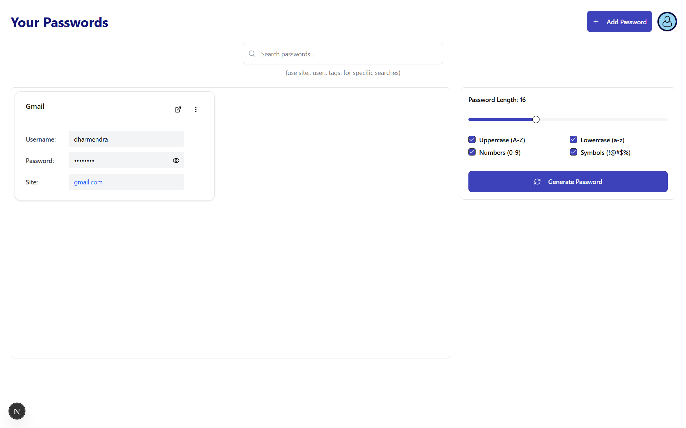

# Secure Pass 🔐

A secure, user-friendly password manager web application built with Next.js and TypeScript. It provides encryption-based password storage, user authentication, and streamlined password management through a modern React-based interface.



---

## Table of Contents

- [About](#about)
- [Security](#security)
- [Folder Structure](#folder-structure)
- [Features](#features)
- [Tech Stack](#tech-stack)
- [Getting Started](#getting-started)
- [Usage](#usage)
- [API Endpoints](#api-endpoints)
- [License](#license)

---

## About

Secure Pass is designed to give users a safe vault to store, manage, and generate strong passwords. By leveraging encryption techniques and JWT-based authentication, it ensures the confidentiality and integrity of your credentials. The app offers an intuitive dashboard, allowing users to search, add, edit, reveal, and delete passwords securely.

---
## Security

- Passwords are encrypted on the server using AES-256-CBC before storage.
- Passwords are hashed and salted using bcrypt for user authentication.
- JWT tokens are employed for secure, stateless sessions.
- API routes are protected with authentication middleware.
- Encryption keys and secrets must be kept secure via environment variables.

### Cryptography Choices

**AES-256-CBC** is used for password encryption because it's a battle-tested symmetric encryption standard that provides strong security with efficient performance. **Bcrypt** is chosen for password hashing as it includes built-in salting and is computationally intensive, making brute-force attacks impractical. These industry-standard algorithms ensure your passwords remain protected both at rest and during authentication.

---

## Folder Structure

```
secure-pass/
├── src/
│   ├── app/
│   │   ├── api/                      # API routes
│   │   │   ├── auth/                 # Authentication endpoints
│   │   │   │   ├── route.ts
│   │   │   │   ├── login/
│   │   │   │   │   └── route.ts
│   │   │   │   └── signup/
│   │   │   │       └── route.ts
│   │   │   └── passwords/            # Password management endpoints
│   │   │       ├── route.ts
│   │   │       └── [id]/
│   │   │           ├── route.ts
│   │   │           └── reveal/
│   │   │               └── route.ts
│   │   └── auth/             # SignUp and Login page
│   │       page.tsx  
│   │   page.tsx              # Dashboard page
│   │   layout.tsx            # Main layout
│   ├── components/           # React UI components
│   ├── contexts/             # React contexts (e.g., AuthContext)
│   ├── lib/                  # Utilities, middleware, encryption, JWT helpers
│   ├── schemas/              # Zod schemas for form validation
│   └── services/             # API interaction services
├── package.json              # Project dependencies and scripts
├── tsconfig.json             # TypeScript configuration
├── next.config.ts            # Next.js configuration
├── postcss.config.mjs        # PostCSS configuration
└── eslint.config.mjs         # ESLint configuration
```

---

## Features

- User Signup and Login with JWT Authentication 🔑
- Add, Edit, and Delete Passwords
- Encrypt stored passwords using AES-256 encryption
- Reveal decrypted passwords securely
- Password generator with customizable options
- Search passwords by site, username, tags, or title
- Responsive and accessible UI with Tailwind CSS and Radix UI components (Shadcn/ui)
- Real-time form validation with Zod and React Hook Form
- Dark mode and theming support

---

## Tech Stack

- **Frontend:** Next.js 15, React 19, TypeScript, Tailwind CSS, Radix UI
- **Backend:** Next.js API routes, Node.js, MongoDB via Mongoose
- **Authentication:** JWT tokens, bcrypt for password hashing
- **Security:** AES-256-CBC encryption for password data
- **Form Validation:** Zod, React Hook Form
- **Notifications:** Sonner toast notifications
- **Icons:** Lucide React

---

## Getting Started

### Prerequisites

- Node.js (v18 or higher recommended)
- MongoDB instance (local or cloud)
- Environment variables set for:

  ```
  MONGODBURI=<your-mongodb-connection-string>
  ENCRYPTIONKEY=<32-byte-encryption-key>
  JWT_SECRET=<jwt-secret-key>
  ```

- To generate 32-byte-encryption-key use this command 

  ```
  node -e "console.log(require('crypto').randomBytes(32).toString('hex'))"
  ```

### Installation

1. Clone the repo:

   ```
   git clone https://github.com/dharmendra-007/secure-pass.git
   cd secure-pass
   ```

2. Install dependencies:

   ```
   npm install
   # or
   yarn
   # or
   pnpm install
   ```

3. Create a `.env` file with your environment variables.

4. Run the development server:

   ```
   npm run dev
   # or
   yarn dev
   ```

5. Open your browser at [http://localhost:3000](http://localhost:3000) to access the app.

---

## Usage

- Sign up to create a new account.
- Log in with your credentials.
- Use the dashboard to add, search, edit, and delete passwords.
- Generate strong passwords using the built-in password generator.
- Reveal encrypted passwords safely for use.

---

## API Endpoints

- **Auth:**
  - `POST /api/auth/signup` - Register new user
  - `POST /api/auth/login` - User login to receive JWT
  - `POST /api/auth/logout` - User logout (handled client-side)

- **Passwords:**
  - `GET /api/passwords` - Fetch all passwords (optional search query)
  - `POST /api/passwords` - Add a new password entry
  - `PUT /api/passwords/[id]` - Update a password by ID
  - `DELETE /api/passwords/[id]` - Delete a password by ID
  - `POST /api/passwords/[id]/reveal` - Reveal decrypted password securely

---

## License

This project is licensed under the MIT License. See the LICENSE file for details.

---

Made with ❤️ by Dharmendra